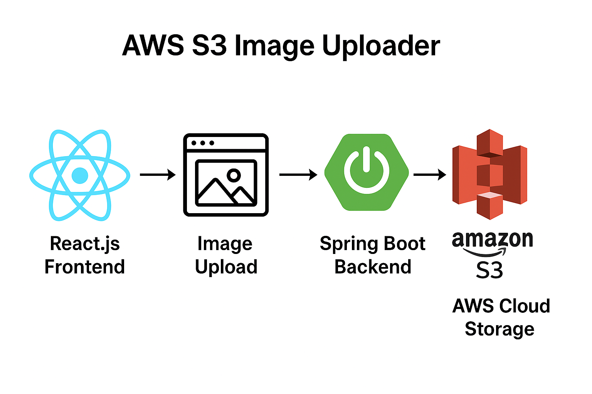


This project is a full-stack web application built with Spring Boot and React.js that allows users( customers) to upload images to Amazon S3 with ease through a secure and scalable setup. It demonstrates how to integrate a modern frontend with a robust backend, while securely handling image uploads to cloud storage. It’s built with Spring Boot (backend) and React.js (frontend), showcasing how to integrate cloud storage with a modern web stack.

## How it works

The app uses a simple but powerful architecture:
The React.js frontend lets users select and upload customer image. That image is sent to the Spring Boot backend, which validates and prepares it for upload. The backend then communicates with AWS S3, either by streaming the image directly to the bucket or generating a pre-signed S3 URL for the frontend to upload securely without exposing credentials. The customer is able to update and delete images in their account.
Once the upload completes, the backend stores image metadata  in the database and returns the file link for display in the app.


## Features

Upload images and files directly to an AWS S3 bucket.

Retrieve and display uploaded files dynamically.

Handles file validation and error management.

Full-stack integration: Spring Boot backend + React.js frontend.

## Technologies Used


Backend: Java, Spring Boot, Spring Data JPA, Maven

Frontend: React.js

Cloud Storage: Amazon S3

IDE: IntelliJ IDEA

Database: PostgreSQL, MySQL

Infrastructure: Docker


## Project Structure

backend/ → Spring Boot backend with S3 service integration.

frontend/ → React.js frontend for file upload interface.

## Quick Start

Follow these steps to run the project locally:

### 1. Clone the repository
On your terminal, clone the repository:```git clone https://github.com/YIOPTOFF2001/AWS-S3-Image-Uploader.git```

### 2.  Set up your enviroment with Docker
Download the Docker app on your desktop and complete the following tasks:

#### Confirm that docker is installed by entering the following code on your terminal.

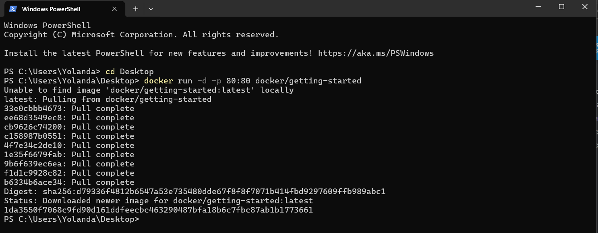

The Docker container should be up and running
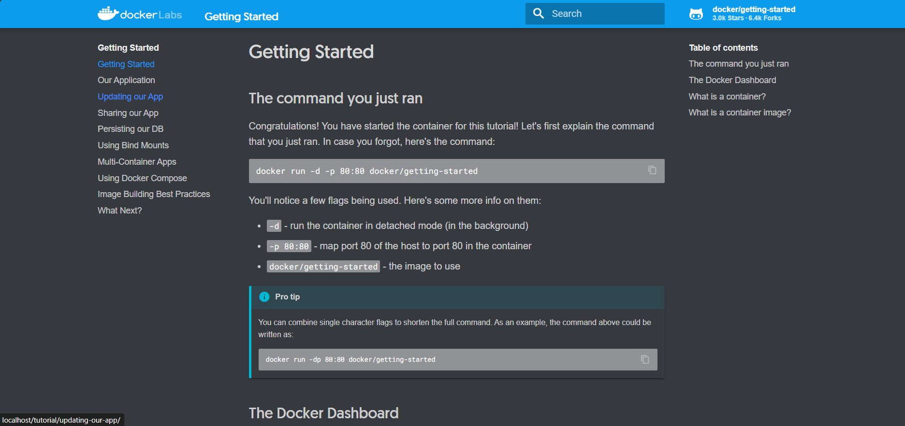

### 3. Get the backend up and running with Docker

On the terminal, get the database container running by entering the following commands:

Note: I have saved the file name from full-stack-professional to AWS-S3-Image-Uploader

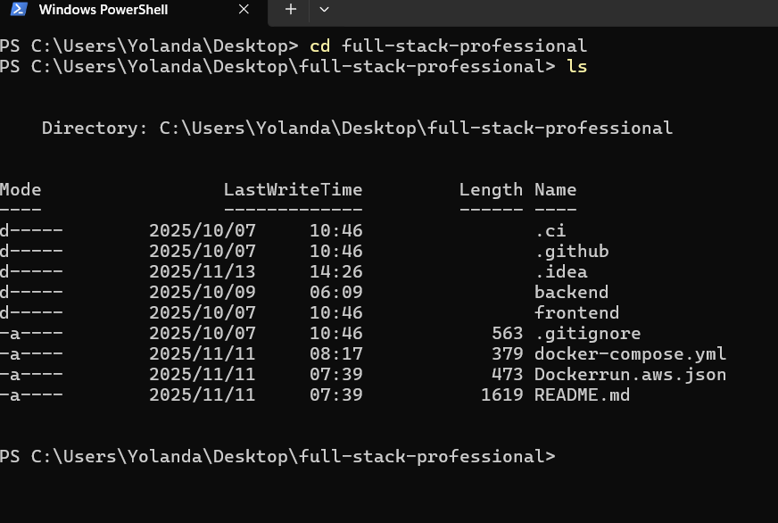

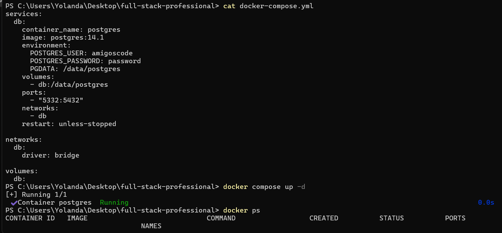

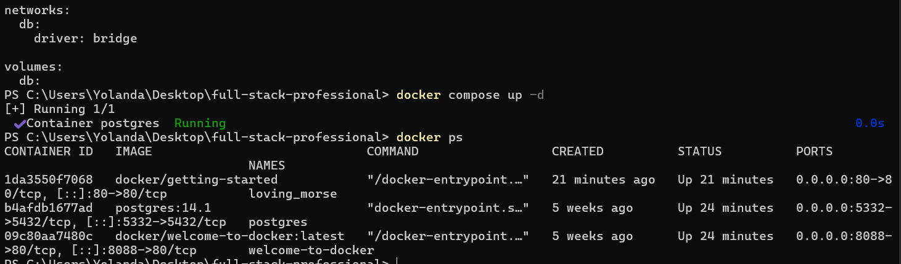

Connect to the postgres file using the following command

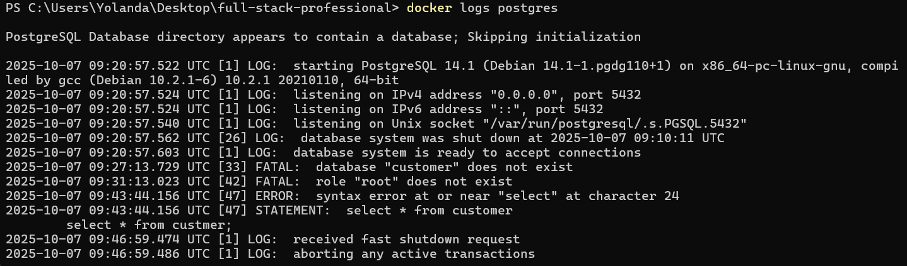

Run the main.java file on InteliJ. The output must be a customer email address

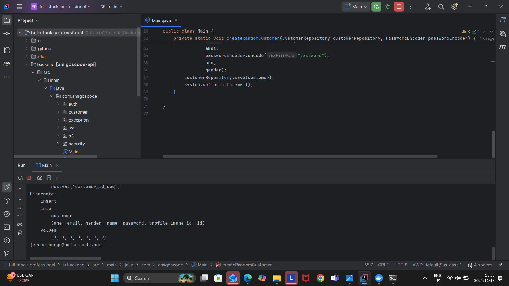

### 4. Get the frontend up and running with Node.js

- Navigate to the frontend with the command: ``` cd frontend/react```

- Install all dependencies with the command: ``` npm install``` on your terminal

- Run the npm frontend with the command: ```npm run dev```

The frontend is up and running: 

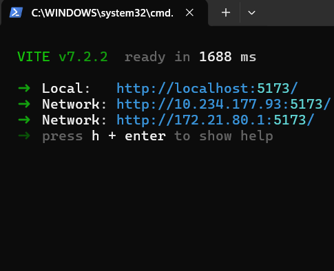

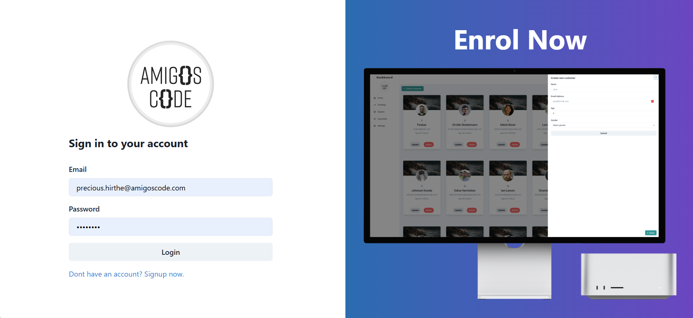

- To login: Enter the email address on main.java file. In this case, the email is : ```jerome.berge@amigoscode.com```
- Password is always: ```password```

## <u> Csutomers can be deleted and added! </u>


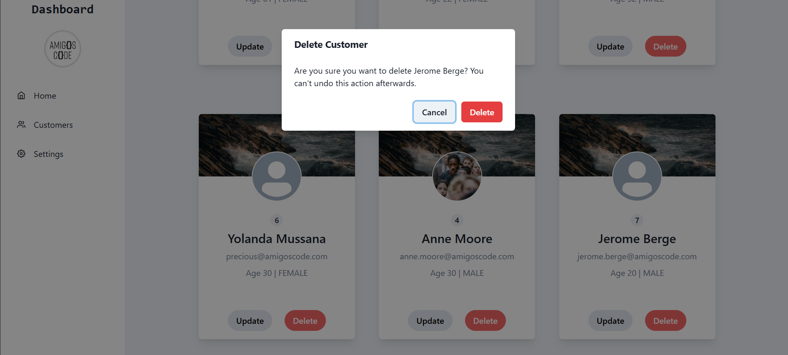

Delete customer

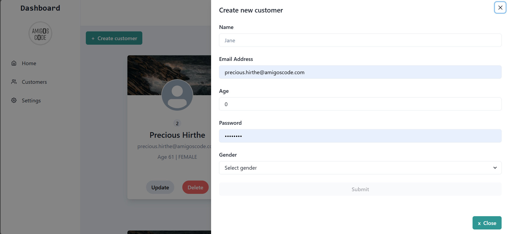

Add a new customer

### 4. Setting up AWS bucket and security credentials 
- Create a folder with a file called 'credentials'
- Create the security credentials on you AWS console account and paste the access key and secret access key on VIM editor (local machine).
- Create an S3 bucket


### 5. App features
Update Customer profile images

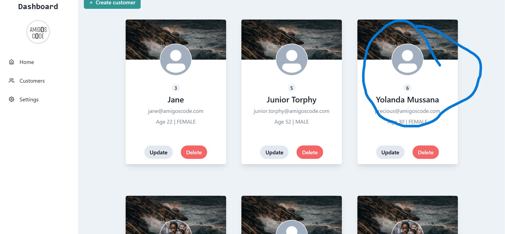
Before
### 5. Storage

```
export const uploadCustomerProfilePicture = async (id, formData) => {
    try {
        return axios.post(
            `${import.meta.env.VITE_API_BASE_URL}/api/v1/customers/${id}/profile-image`,
            formData,
            {
                ...getAuthConfig(),
                'Content-Type' : 'multipart/form-data'
            }
        );
    } catch (e) {
        throw e;
    }
}

export const customerProfilePictureUrl = (id) =>
    `${import.meta.env.VITE_API_BASE_URL}/api/v1/customers/${id}/profile-image`;
```
### 123
```
@GetMapping(
            value = "{customerId}/profile-image",
            produces = MediaType.IMAGE_JPEG_VALUE
    )
```
